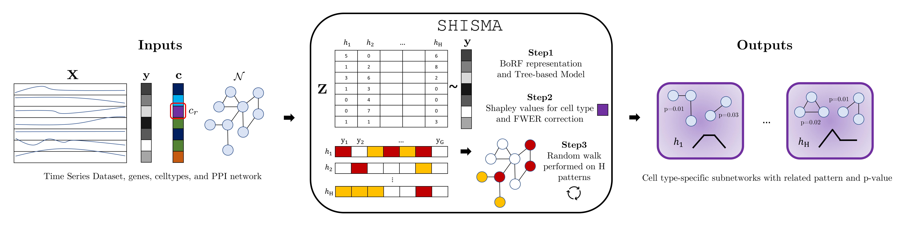

# SHISMA
**SHISMA: SHape-driven Inference of Significant celltype-specific Subnetworks from tiMe series single-cell trAnscriptomics**

Authors: Antonio Collesei, Pierangela Palmerini, Emilia Vigolo, Francesco Spinnato 

---


## Overview
**SHISMA** is a novel algorithm designed to infer statistically significant, cell type-specific subnetworks from time-series single-cell RNA-seq data.  
It combines time series pattern mining (Bag-of-Receptive-Fields) with graph algorithms on Protein-Protein Interaction (PPI) networks, ensuring high statistical rigor through Family-Wise Error Rate (FWER) correction.
## Installation
Clone the repository:
```bash
git clone https://github.com/antoniocollesei/SHISMA.git
cd SHISMA
```
We strongly encourage the installation of requirements via conda/mamba. For this we make the environment .yml file available:
```bash
conda env create -f conda/SHISMA_environment.yml
conda activate SHISMA_env
```

## Time Series Data Formatting
Here we describe how the input dataset must be formatted. Anyway, we share a wrapper named `proprocess.R` that builds the dataset automatically, starting from Seurat RDS objects labeled with a progressively numbered timepoint. Each object must be equipped with two metadata: *patient_id* and *cell_type*. The final dataset should look like this:
| gene_patient_celltype | time0 | time1 | time2 | time3
| :--- | :--- | :--- | :--- | :--- |
| TP53_patientAC_Bcell | 0.8 | 0.1 | 0.04 | 0 |
| ASGR1_patientFS_Ionocyte, | 0.3 | 0.04 | 0.2 | 0 |
| BRCA1_patientPP_Tcell, | 0 | 0.5 | 0.6 | 0.9 |
| MYC_patientEV_Dendritic, | 0.7 | 0 | 0 | 0.1 |

If you prefer to try our data, we provide a real-world dataset (the one described in the paper) in the **Releases** section, also available for download at this [link](https://github.com/antoniocollesei/SHISMA/releases/tag/v1.0-data).

## Inputs
- Time Series File (`--data`): Normalized expression matrix of genes across time points. It must be a tab-separated csv file, with the first column representing the index names in the form of [gene]_[celltype]. Note: we will improve this in an upcoming release to allow for a more user-friendly input file.
- PPI File (`--ppi`): Edge list representing a biological interaction network; it must be a tab-separated file with two columns having names "gene1" and "gene2".
- Cell Type (`--ct`): Specific cell type to focus the analysis on: please be sure that the exact name is present in the index of your data file.
- Output Name (`--out`): Prefix for all generated output files.
- Permutations (`--nperm`): Number of permutations to enable significance testing.
- Multiple Hypotheses Correction Strategy (`--mht`): False Discovery Rate ("fdr") or Bonferroni ("bonferroni") are the two allowed strategies. Default is "fdr", Bonferroni allows for a more stringent analysis.
- Significance Threshold (`--alpha`)
- Cores (`--cores`)

## Usage
Here is a snippet showing the standard use of SHISMA. In brackets, optional parameters can be added, if standard ones are not satisfactory. 
```bash
./wrapper.sh --data <time_series_file> --ppi <ppi_file> --ct <cell_type> --out <output_name> [--nperm 100] [--mht fdr] [--alpha 0.05] [--cores 1]
```

## Outputs
Results are grouped in a folder called `analysis_<output_name>`. The folder contains:
- a TSV file with the list of significant subnetworks for the selected cell type (`aggregated_clusters.tsv`);
- a PDF reference to match the temporal patterns with the ones indexed in the TSV file;
- a subfolder with the temporal dynamics of genes in the significant subnetworks.

## License and Contact
This code is provided under the MIT license. For any inquiries, feel free to reach out to the authors at: [antonio.collesei@iov.veneto.it](mailto:antonio.collesei@iov.veneto.it). We welcome your feedback and contributions!
