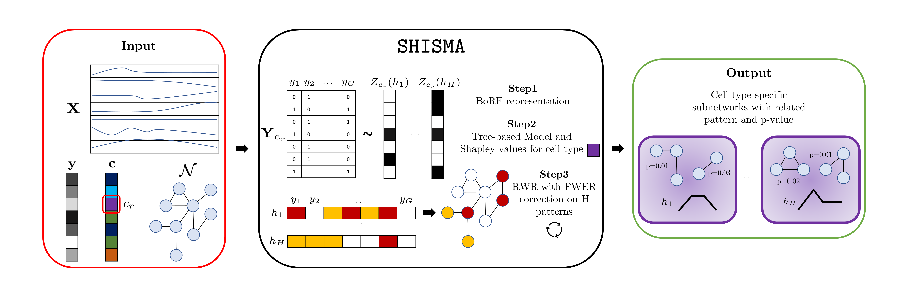
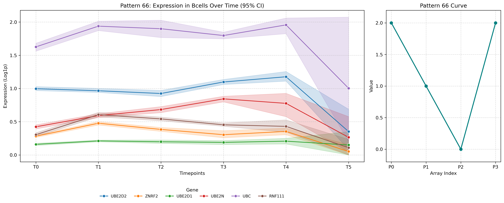

# SHISMA
**SHISMA: SHape-driven Inference of Significant celltype-specific Subnetworks from tiMe series single-cell trAnscriptomics**

Authors: Antonio Collesei, Pierangela Palmerini, Emilia Vigolo, Francesco Spinnato 



## Overview
**SHISMA** is a novel algorithm designed to infer statistically significant, celltype-specific subnetworks from time-series single-cell RNA-seq data.  
It combines time series pattern mining (Bag-of-Receptive-Fields) with graph algorithms on Protein-Protein Interaction (PPI) networks, ensuring high statistical rigor through Family-Wise Error Rate (FWER) correction.

## Installation
Clone the repository:
```bash
git clone https://github.com/antoniocollesei/SHISMA.git
cd SHISMA/shisma_pkg
```
We strongly encourage the installation of requirements via conda/mamba. For this we make the `SHISMA_environment.yml` file available. Since [**BoRF**](https://github.com/fspinna/borf) is not available under any conda channel, it must be installed via pip. The following snippet presents the environment creation step by step.
```bash
conda env create -f conda/SHISMA_environment.yml
conda activate SHISMA_env
pip install git+https://github.com/fspinna/borf.git@xai-improvements
```
Now, we are ready to install the actual SHISMA package via setup.
```bash
pip install -e .
```
Finally, we can run `shisma` directly from command line.

## Time Series Data Formatting
Here we describe how the input dataset must be formatted. Anyway, we share a R-based wrapper named `preprocess.R` that builds the dataset automatically, starting from Seurat RDS objects labeled with a progressively numbered timepoint. Each object must be equipped with two metadata: *patient_id* and *celltype*. The final dataset should look like this:
| gene_patient_celltype | time0 | time1 | time2 | time3
| :--- | :--- | :--- | :--- | :--- |
| TP53_patientAC_Bcell | 0.8 | 0.1 | 0.04 | 0 |
| ASGR1_patientFS_Ionocyte | 0.3 | 0.04 | 0.2 | 0 |
| BRCA1_patientPP_Tcell | 0 | 0.5 | 0.6 | 0.9 |
| MYC_patientEV_Dendritic | 0.7 | 0 | 0 | 0.1 |

If you prefer to try our data, we provide a real-world dataset (the one described in the paper) in the `data/` folder. It has been uploaded with **git-lfs** therefore, if it still does not appear after cloning, just download it in the old-fashioned way from the repo itself.

## Inputs
- Time Series File (`--expr-matrix`): Normalized expression matrix of genes across time points. It must be a tab-separated csv file, with the first column representing the index names in the form of [gene]\_[patient]\_[celltype]. Note: we will improve this in an upcoming release to allow for a more user-friendly input file.
- PPI File (`--ppi-network`): Edge list representing a biological interaction network; it must be a tab-separated file with two columns having names "gene1" and "gene2".
- Cell Type (`--target-ct`): Specific celltype to focus the analysis on: please be sure that the exact name is present in the index of your data file.
- Output Name (`--output-dir`): Prefix for all generated output files.
- Permutations (`--nperms`): Number of permutations to enable significance testing.
- Multiple Hypotheses Correction Strategy (`--mht-correction`): False Discovery Rate ("fdr") or Bonferroni ("bonferroni") are the two allowed strategies. Default is "fdr", Bonferroni allows for a more stringent analysis.
- Significance Threshold (`--alpha`): The default value is 0.05, so you do not really want to touch this parameter.
- Cores (`--n-jobs`): Cores to be employed for the analysis. Default is all available cores (-1).

Additionally, if you want to modify BoRF default parameters, for example adjusting the window size to reduce/extend the search space, you can modify the `shisma_pkg/shisma/borf_configuration.py` file. This is the standard configuration set we used for our experiments, with an increasing window_size and word_length from 2 to 4, and an alphabet_size of 3 (low, medium, high).
```python
BORF_CONFIG = [
    {
        "window_size": 2,
        "stride": 1,
        "dilation": 1,
        "word_length": 2,
        "alphabet_size": 3,
    },
    {
        "window_size": 3,
        "stride": 1,
        "dilation": 1,
        "word_length": 3,
        "alphabet_size": 3,
    },
    {
        "window_size": 4,
        "stride": 1,
        "dilation": 1,
        "word_length": 4,
        "alphabet_size": 3,
    }
]
```

## Usage
Here is a snippet showing the standard use of SHISMA. In brackets, optional parameters can be added, if standard ones are not satisfactory. 
```bash
shisma --expr-matrix <time_series_matrix_file> --ppi-network <ppi_file> --target-ct <celltype> --output-dir <output_name> [--nperms 1000] [--mht-correction fdr] [--alpha 0.05] [--n-jobs -1]
```
**Warning**: While running the script, some warnings might appear (*IPython could not be loaded.*), depending on the OS you are running. They do not harm the pipeline. We are currently trying to make them disappear in every iteration, since they may be annoying.

## Outputs
The results are presented in tabular form, offering the following details. Below an example for a Bcell analysis, with Bonferroni as FWER correction method.
| Subnetwork_id | Pattern | Size | Pvalue_fdr | Genes | Pvalue_specificity_Bcell
| :--- | :--- | :--- | :--- | :--- | :--- |
| 0 | 66 | 6 | 0.0019 | RNF111, UBC, UBE2D1, UBE2D2, UBE2N, ZNRF2 | 0.0006 |
| 1 | 30 | 5 | 0.0023 | LAMTOR1, LAMTOR2, LAMTOR3, MLST8, MTOR | 0.004 |

A plot showing the gene dynamics across the patients' cohort is also available for any significant result.


## License and Contact
This code is provided under the GNU GPL v3 license. For any inquiries, feel free to reach out to the authors at: [antonio.collesei@iov.veneto.it](mailto:antonio.collesei@iov.veneto.it) or open an issue here on GitHub. We welcome your feedback and contributions!